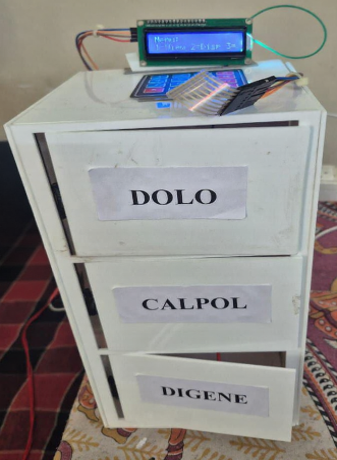
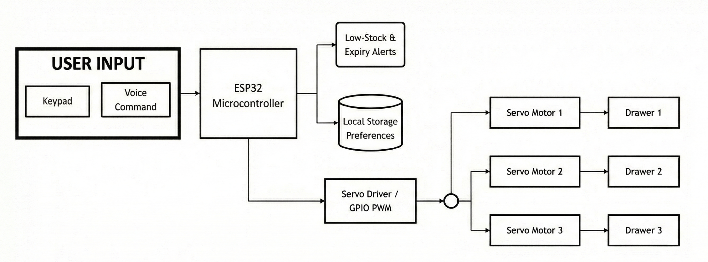
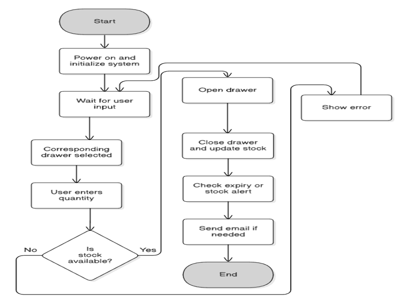
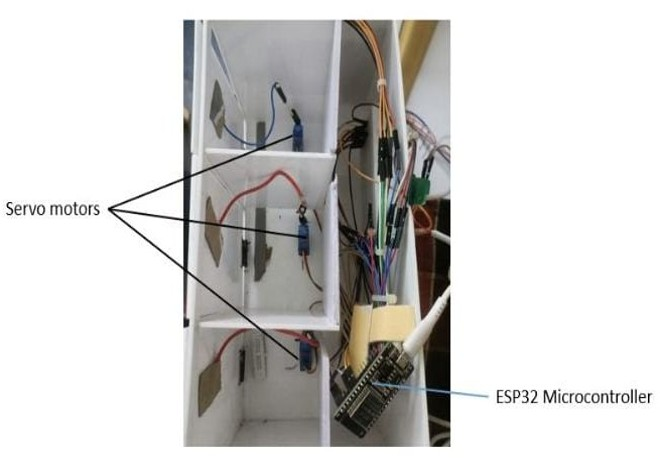

# Smart Medicine Cabinet

An ESP32-based Smart Medicine Cabinet designed to automate medicine dispensing and inventory monitoring in pharmacies and medical stores.

---

## Project Overview

Manual medicine management in pharmacies can lead to delays, stock mismanagement, and human errors.  
This project introduces an automated cabinet system that helps in organized medicine dispensing and real-time inventory monitoring.

The system uses an ESP32 microcontroller to control servo-based drawers, allowing medicines to be accessed using keypad input or voice commands.

---

## Key Features

• Automated medicine drawer opening using servo motors  
• Medicine selection using a 4×4 keypad  
• Voice command support using the Dabble mobile application  
• LCD display showing system status and medicine details  
• Real-time medicine stock monitoring  
• Email alerts for low stock and approaching expiry dates  

---

## Hardware Components

- ESP32 Microcontroller  
- SG90 Servo Motors  
- 4×4 Matrix Keypad  
- 16×2 LCD Display  
- Power Supply Module  
- Medicine Cabinet Structure  

---

## Software Used

- Arduino IDE  
- Embedded C/C++  
- Dabble Mobile Application  
- WiFi Library for ESP32  
- SMTP Email Notification System  

---

## Working Principle

1. The user enters the medicine code through the keypad or voice command.
2. The ESP32 processes the input and identifies the corresponding drawer.
3. The servo motor opens the required drawer.
4. The system updates the inventory count.
5. If stock is low or expiry is near, an email alert is sent to the user.

---

## Project Structure

```
Smart-Medicine-Cabinet
│
├── smart_medicine_cabinet.ino
├── images
│   ├── prototype.jpg
│   ├── block_diagram.png
│   └── flowchart.png
│
├── report
│   └── project_report.pdf
│
└── README.md
```

---

## Future Improvements

• AI-based prescription recognition  
• Mobile application integration  
• Biometric authentication for secure access  
• Cloud-based medicine inventory system  

---
## Project Prototype



## Block Diagram



## Flowchart



## Internal Circuit



## Author

Subham Sinha  
B.E Electronics & Communication Engineering  
Siddaganga Institute of Technology
